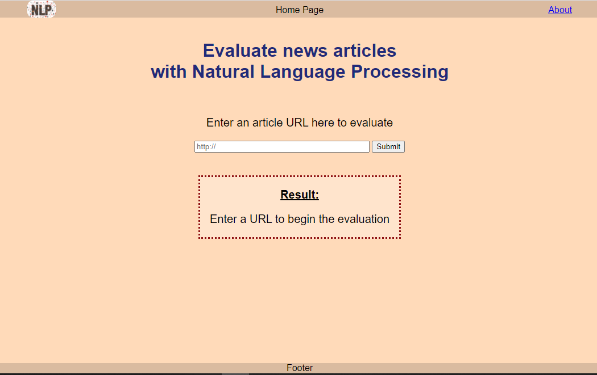
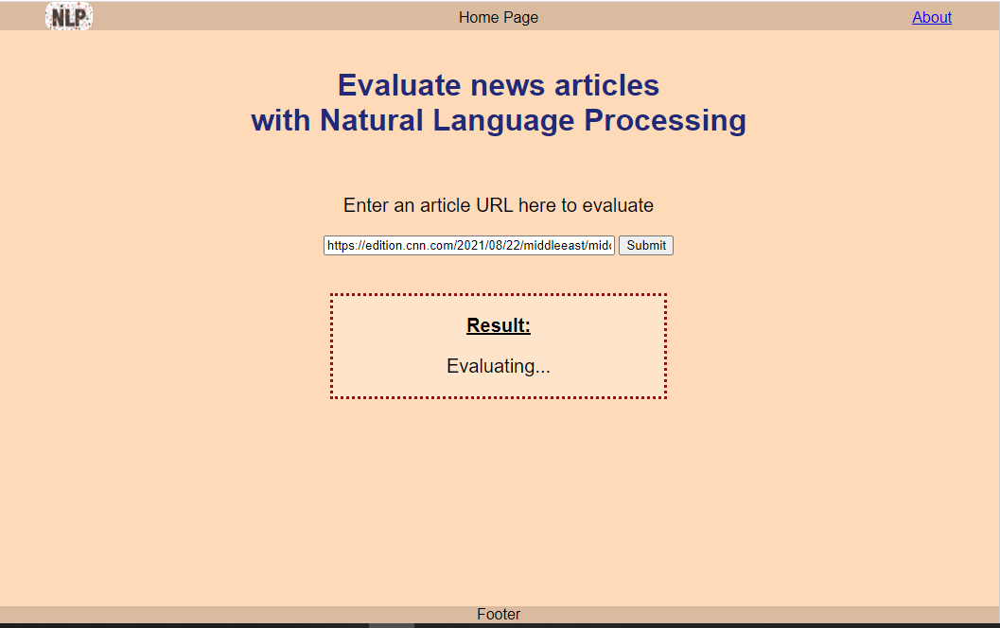
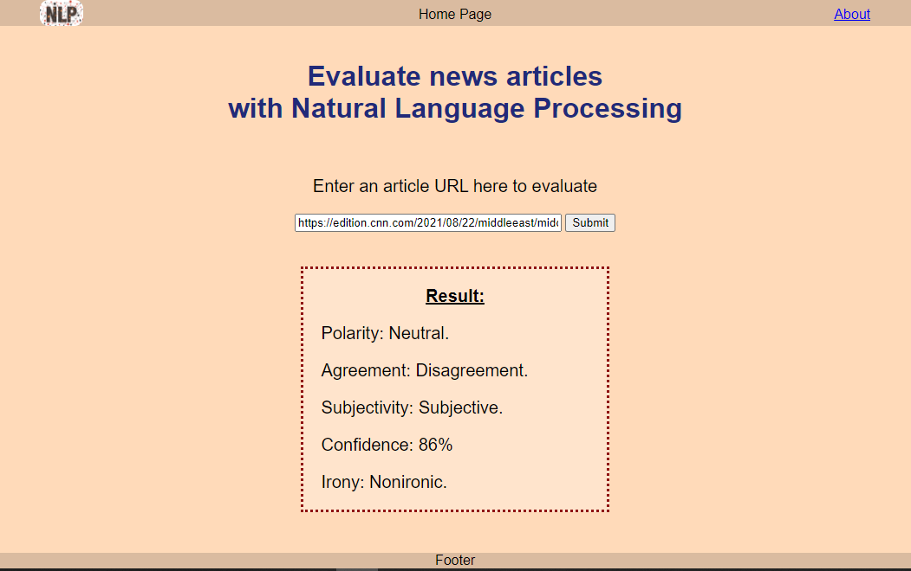
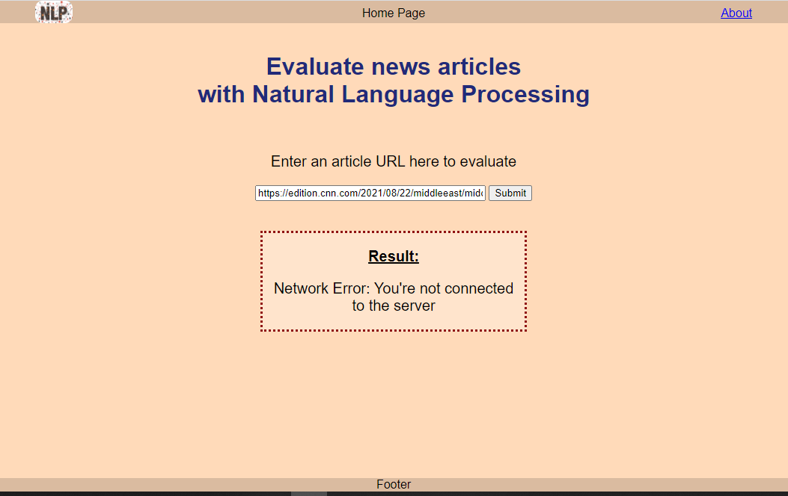
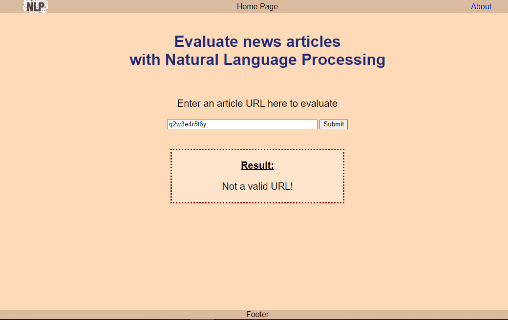
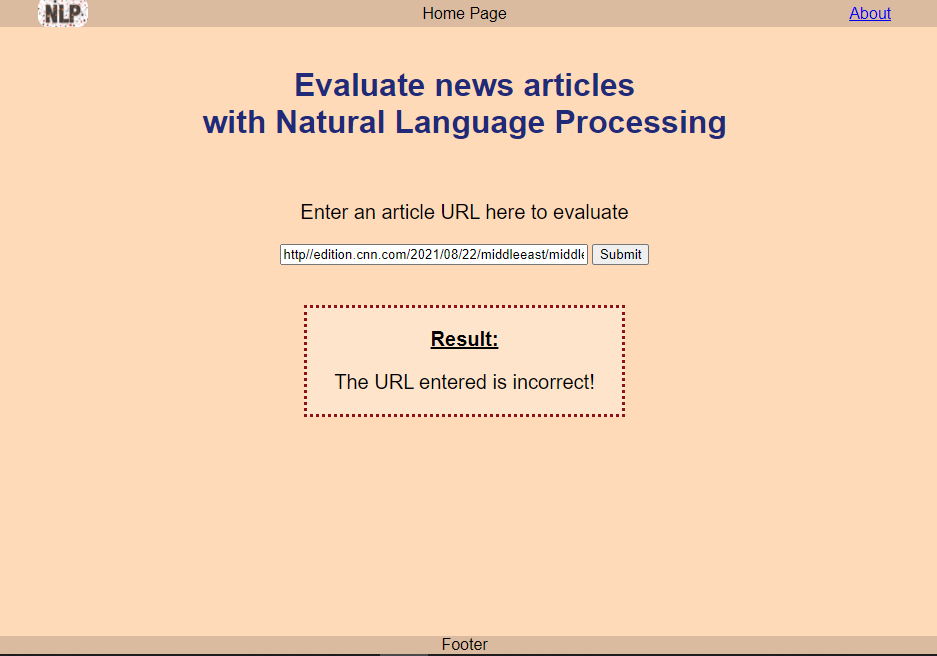

# Evaluate news articles with Natural Language Processing

This project uses Webpack as the build tool, express to run the server, and the Sentiment Analysis API to analyze articles or blogs throught NLP and outputs the text analysis result in the form of:

- Polarity (positive, negative or neutral).
- Agreement (agreement or disagreement).
- Subjectivity (subjective or objective).
- Confidence (measured in percentage).
- Irony (ironic or nonironic).

For more information about the API, visit https://learn.meaningcloud.com/developer/sentiment-analysis/2.1/doc

## Description

- Project starts with building the HTML file with the SCSS and JavaScript files.
- Setting up Webpack with loaders and plugins.
- Using meaning cloud to request for the Sentiment Analysis API data.
- Using jest to run tests.
- Registering service workers for offline functionality.

## Getting Started

1. Clone repo by `git clone <repo>` or download ZIP.
2. Move to the project folder by `cd <folder path/name>`
3. Install npm by `npm install`
4. Run the productiom build by `npm run build-prod`
5. Start the server at port 8081 by `npm run start`
6. To run the development build, use `npm run build-dev`
7. To start the development server at port 8080, user `npm run dev-server`

## Prerequisites

1. sign in to https://www.meaningcloud.com/developer/sentiment-analysis to get your API KEY

2. In your root folder, create a .env file, and put your key as
   `API_KEY = ********************************`

## Running the tests

Run tests by `npm run test`

`> jest`

```
PASS **test**/testCheckURL.spec.js (11.18 s)
PASS **test**/testSubmitForm.spec.js (11.662 s)

Test Suites: 2 passed, 2 total
Tests: 5 passed, 5 total
Snapshots: 0 total
Time: 14.454 s
Ran all test suites.
```

## Built With

- HTML
- SCSS
- JavaScript
- Express
- Webpack 5
- Meaningcloud API
- Jest
- Workbox

## Demo

#### Home page



#### Analyzing article



#### Analysis result



#### Network Error (Stopping the server on port 8081)



#### Entering strings



#### Entering a bad URL (doesn't direct to a real webpage)



### Acknowledgments

https://github.com/mohammedelzanaty/udacity-projects-starter-kit/blob/main/evaluate-news-article/src/client/js/checkURL.js

https://www.w3resource.com/javascript-exercises/javascript-regexp-exercise-9.php

https://stackoverflow.com/questions/64617228/cleanwebpackplugin-does-not-clean-in-webpack-5

https://webpack.js.org/guides/

https://dev.to/btandayamo/a-guide-to-through-async-await-with-babel-and-webpack-mh5

https://babeljs.io/docs/en/babel-polyfill.html

https://webpack.js.org/guides/shimming/

https://github.com/mohammedelzanaty/udacity-projects-starter-kit/blob/main/evaluate-news-article/package.json

https://stackoverflow.com/questions/64874484/js-referenceerror-fetch-is-not-defined

https://stackoverflow.com/questions/50687064/method-post-with-axios-giving-error-404-reactjs

https://stackoverflow.com/questions/62111952/request-failed-with-status-code-404-error

https://stackoverflow.com/questions/55879126/axios-post-request-get-body-from-catch

https://stackoverflow.com/questions/63656590/axios-post-request-in-react-to-express-server-is-returning-404

https://stackoverflow.com/questions/40195766/lowercase-all-letters-in-a-string-except-the-first-letter-and-capitalize-first-l/40195890

https://jasonwatmore.com/post/2021/06/25/axios-http-post-request-examples

https://blog.logrocket.com/how-to-make-http-requests-like-a-pro-with-axios/

https://stackoverflow.com/questions/35756479/does-jest-support-es6-import-export

https://jestjs.io/docs/using-matchers

https://stackoverflow.com/questions/39798095/multiple-html-files-using-webpack/63385300

https://webpack.js.org/guides/asset-management/#loading-images

https://stackoverflow.com/questions/47126503/how-to-load-images-through-webpack-when-using-htmlwebpackplugin

https://guides.github.com/features/mastering-markdown/
